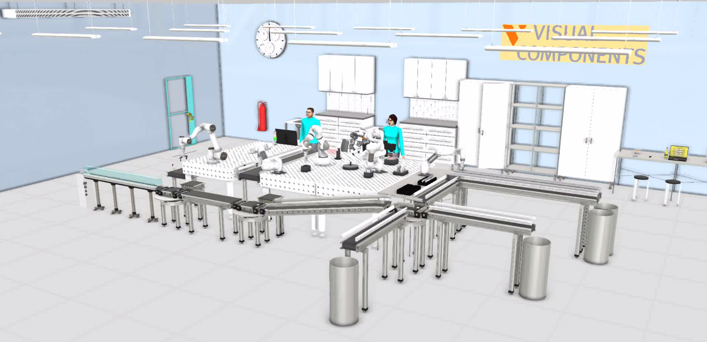
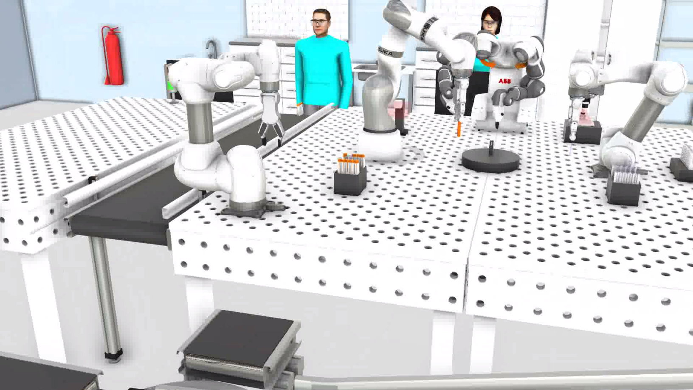
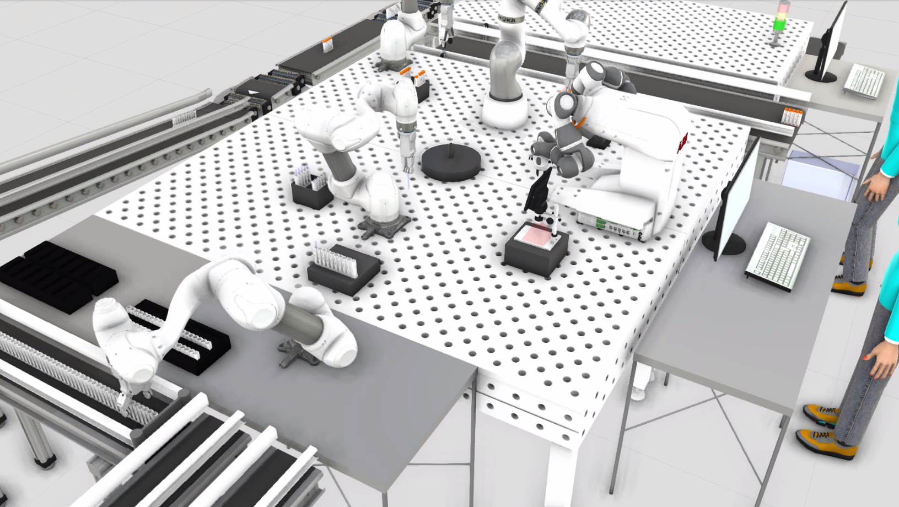
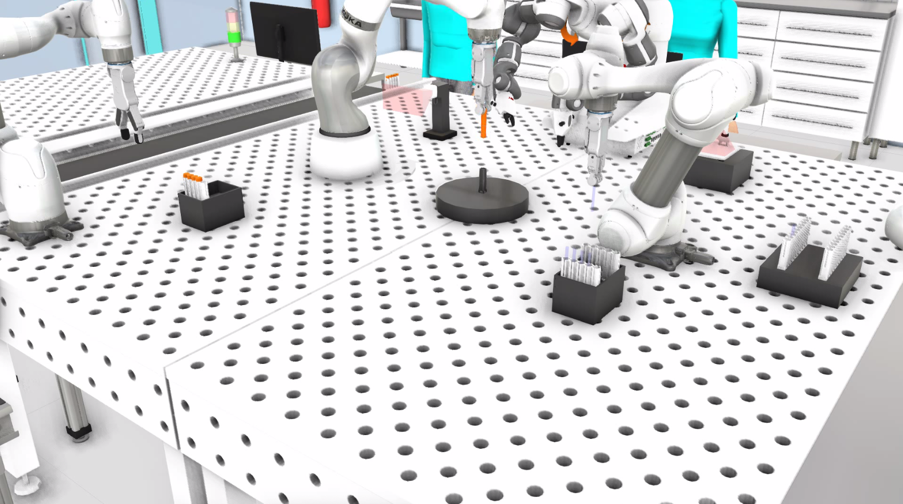

<b><h2>Laboratory test cell </h2></b>

Team project 2 is laboratory test cell made in Visual Components 4.3.
Visual Components software is used for applications including layout planning, production simulation, off-line programming and PLC verification.

## Images

 

 

 

